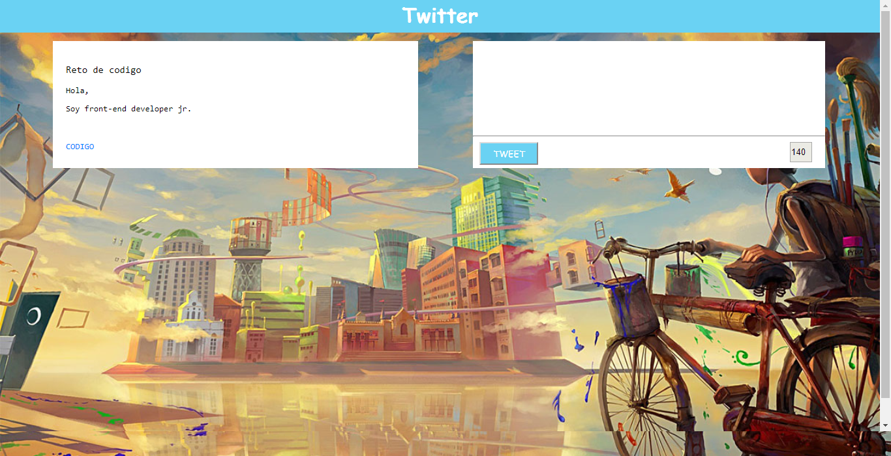

# Twitter

* **Curso:** _Creando tu primer sitio web interactivo_
* **Unidad:** _ Creando interacción con JavaScript_

***

## Objetivo

En este reto, vamos a replicar el newsfeed de **Twitter**
> Nota: Puedes adaptar el diseño como mejor te parezca, pero no tardes mucho definiendo los colores o fuentes.

## Desarrollo

* evento para agregar el mensaje escrito
  `var button = document.getElementById("button");
  button.addEventListener("click", addText);`
* evento para agregar contador de letras//
  `var text = document.getElementById("text");
  text.addEventListener("keyup", addAccount);`
* creando funcion para addText que añade debajo el mensaje escrito
`function addText() {
  var container = document.createElement("div");
  var message= document.createElement("p");
    container.appendChild(message);
  };`

* creando funcion para addAccount que añade contador de caracteres
`function addAccount(){
  var max = "140";
  var message = document.getElementById("text").value;
  var longitud = message.length;
    if(longitud<"140"){
    contador.value =longitud-max;
    }
  };`

## Resultado

