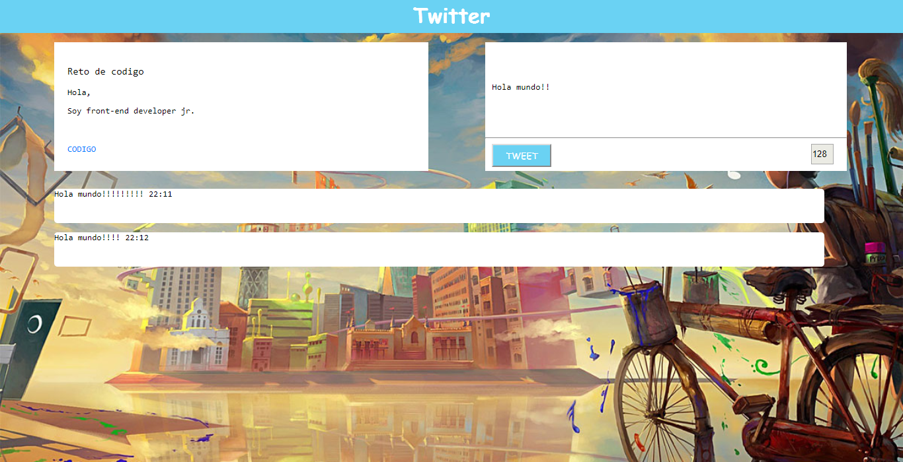

# Twitter

* **Curso:** _Creando tu primer sitio web interactivo_
* **Unidad:** _ Creando interacción con JavaScript_

***

## Objetivo

En este reto, vamos a replicar el newsfeed de **Twitter**
> Nota: Puedes adaptar el diseño como mejor te parezca, pero no tardes mucho definiendo los colores o fuentes.

## Desarrollo

1. *Evento para agregar el mensaje escrito*
  `var button = document.getElementById("button");`
  `button.addEventListener("click", addText);`
2. *Evento para agregar contador de letras*
  `var text = document.getElementById("text");`
  `text.addEventListener("keyup", addAccount);`
3. *Creando funcion para addText que añade debajo el mensaje escrito*
  `function addText() {`
  `var container = document.createElement("div");`
  `var message= document.createElement("p");`
    `container.appendChild(message);`
  `};`
4. *Creando funcion para addAccount que añade contador de caracteres*
  `function addAccount(){`
  `var max = "140";`
  `var message = document.getElementById("text").value;`
  `var longitud = message.length;`
    `if(longitud<"140"){`
    `contador.value =longitud-max;`
    `}`
  `};`

## Resultado

